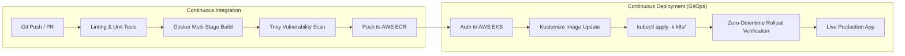

# 🚀 Enterprise EKS GitOps CI/CD Pipeline


-ff9900?logo=amazon-aws&style=for-the-badge)


A production-grade **Cloud Native Microservice** and automated **GitOps CI/CD Pipeline** built for Amazon Elastic Kubernetes Service (AWS EKS), featuring DevSecOps container security scanning, zero-downtime rolling deployments, automated rollbacks, and interactive observability.

Companion Infrastructure Repository: **[terraform-aws-eks-production](https://github.com/devopsfaisal/terraform-aws-eks-production)**

> 🌐 **Interactive Learning Paths / مبدّل اللغات / भाषा चुनें**:  
> [🇬🇧 English Guide](docs/LEARNING_PATH.md) • [🇮🇳 Hinglish गाइड (सरल भाषा)](docs/LEARNING_PATH.hi.md) • [🇸🇦 الدليل العربي الكامل](docs/LEARNING_PATH.ar.md)

---

## 🏗️ Architecture & Pipeline Flow



---

## 📂 Repository Structure

```
├── .github/
│   └── workflows/
│       └── ci-cd-pipeline.yml     # Complete GitHub Actions CI/CD workflow
├── app/
│   ├── app.py                     # Python Flask Microservice with /healthz, /readyz, /metrics
│   ├── requirements.txt           # Production dependencies (Flask, Gunicorn, Prometheus)
│   ├── requirements-dev.txt       # Dev & test dependencies (pytest, flake8)
│   ├── templates/
│   │   └── index.html             # Glassmorphism Cloud Native Dashboard
│   └── test_app.py                # Automated unit tests
├── k8s/
│   ├── namespace.yaml             # Production namespace definition
│   ├── deployment.yaml            # Zero-downtime RollingUpdate deployment
│   ├── service.yaml               # ClusterIP service
│   ├── hpa.yaml                   # HorizontalPodAutoscaler (CPU & Memory)
│   ├── pdb.yaml                   # PodDisruptionBudget (HA during upgrades)
│   ├── ingress.yaml               # AWS Load Balancer Controller Ingress (ALB)
│   └── kustomization.yaml         # Kustomize overlay configuration
├── docs/
│   └── PIPELINE_ARCHITECTURE.md   # Deep dive architecture & Top 15 SRE Interview Q&A
├── Dockerfile                     # Multi-stage rootless Alpine Dockerfile
├── .dockerignore                  # Build context exclusions
└── README.md                      # Repository documentation
```

---

## 🔐 GitHub Secrets Configuration

To enable the automated pipeline to authenticate with your AWS account and deploy to your EKS cluster, configure the following secrets in your GitHub repository (**Settings > Secrets and variables > Actions**):

| Secret Name | Required | Description |
| :--- | :---: | :--- |
| `AWS_ROLE_ARN` | **Recommended** | IAM Role ARN for passwordless GitHub Actions OIDC authentication |
| `AWS_ACCESS_KEY_ID` | Alternative | AWS IAM User Access Key ID (if not using OIDC) |
| `AWS_SECRET_ACCESS_KEY` | Alternative | AWS IAM User Secret Access Key (if not using OIDC) |

> **Note**: The pipeline is pre-configured to automatically target:
> - **Region**: `ap-south-1` (Mumbai)
> - **Cluster Name**: `eks-production-cluster`
> - **ECR Repository**: `eks-demo-app` (automatically created if not present)

---

## 🧪 Local Testing & Development

### 1. Run Unit Tests Locally
```bash
# Setup virtual environment
python3 -m venv .venv
source .venv/bin/activate

# Install dependencies
pip install -r app/requirements.txt -r app/requirements-dev.txt

# Run test suite
python -m unittest discover -s app -v
```

### 2. Run with Docker
```bash
# Build rootless image
docker build -t eks-demo-app:local .

# Run container
docker run -p 8080:8080 eks-demo-app:local

# Access in browser
open http://localhost:8080
```

---

## 🚀 Key Production Features

1. **Zero-Downtime Deployments**: Configured with `maxSurge: 25%` and `maxUnavailable: 0` so no active pods are terminated until new pods pass health checks.
2. **Automated Rollback**: If a new deployment fails or times out within 180 seconds, `kubectl rollout undo` automatically rolls back to the last known good revision.
3. **DevSecOps In-Line Scanning**: Aqua Trivy scans all container layers for vulnerabilities before publishing to AWS ECR.
4. **Cloud Native Observability**: Native `/metrics` endpoint compatible with Prometheus and Grafana.
5. **High Availability**: PodDisruptionBudget ensures minimum availability during node updates, while HPA autoscales up to 10 replicas under high load.

---

## 📚 In-Depth Learning & Interview Prep
For comprehensive architectural deep dives and the **Top 15 Real-World DevOps / SRE EKS CI/CD Interview Questions & Answers**, read our interactive learning paths:
- 🇬🇧 **[English Master Guide](docs/LEARNING_PATH.md)**
- 🇮🇳 **[Hinglish Mastery Path (सरल भाषा)](docs/LEARNING_PATH.hi.md)**
- 🇸🇦 **[الدليل العربي الشامل للمؤسسات](docs/LEARNING_PATH.ar.md)**
- 🏛️ **[Pipeline Architecture Specification](docs/PIPELINE_ARCHITECTURE.md)**
