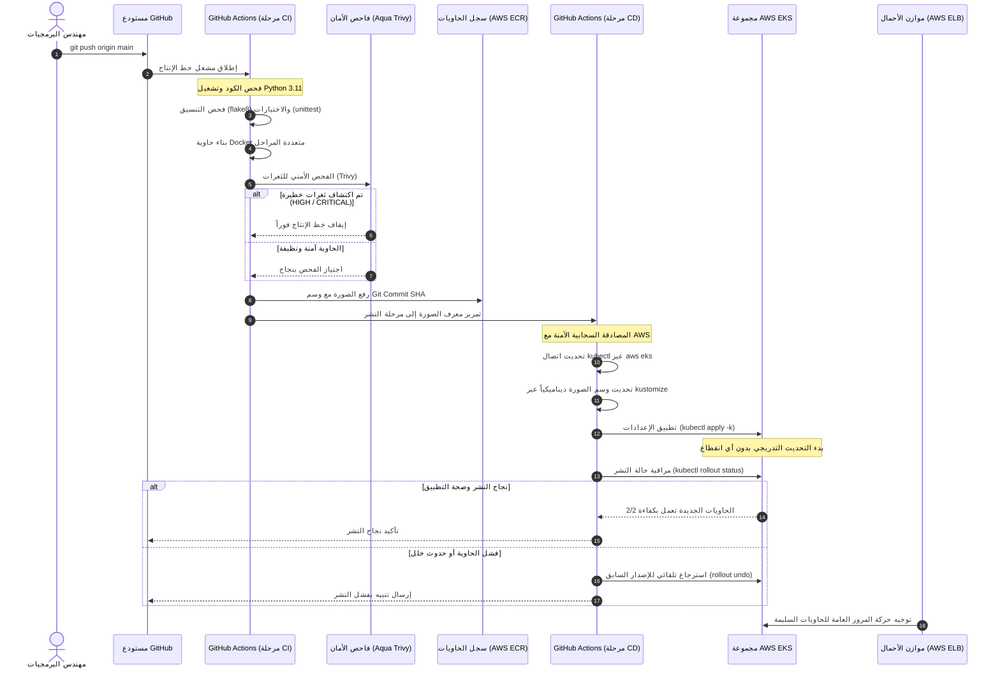

# 🎓 الدليل الشامل والمسار التعليمي لهندسة EKS GitOps CI/CD للمؤسسات

> 🌐 **Language Selector / مبدّل اللغات / भाषा चुनें**:  
> [🇬🇧 English](LEARNING_PATH.md) • [🇮🇳 Hinglish](LEARNING_PATH.hi.md) • **[🇸🇦 العربية (الحالي)]**

> **المؤلف**: [فيصل أنصاري (Faisal Ansari)](https://faisal.host) • [LinkedIn](https://www.linkedin.com/in/clumsyfaisal/)  
> **السحابة المستهدفة**: AWS (`ap-south-1` مومباي)  
> **إدارة الحاويات**: Kubernetes على AWS EKS (`1.36+`)  
> **نمط خط الإنتاج**: GitOps مع حماية DevSecOps (Aqua Trivy) واسترجاع تلقائي بدون توقف  
> **نقطة النهاية العامة الموثقة**: [https://eks.faisal.host](https://eks.faisal.host) (AWS ELB + تشفير ACM SSL/TLS)

---

## 📑 جدول المحتويات
1. [مقدمة في DevOps و GitOps: المفاهيم الأساسية للمبتدئين](#1-مقدمة-في-devops-و-gitops-المفاهيم-الأساسية-للمبتدئين)
2. [المخطط المعماري الكامل لخط الإنتاج وتدفق البيانات](#2-المخطط-المعماري-الكامل-لخط-الإنتاج-وتدفق-البيانات)
3. [بناء الحاويات والأمان المتقدم (Dockerfile و Aqua Trivy)](#3-بناء-الحاويات-والأمان-المتقدم-dockerfile-و-aqua-trivy)
4. [معمارية خط العمل في GitHub Actions (.github/workflows)](#4-معمارية-خط-العمل-في-github-actions-githubworkflows)
5. [تنسيقات Kubernetes وتصميم أحمال العمل الإنتاجية](#5-تنسيقات-kubernetes-وتصميم-أحمال-العمل-الإنتاجية)
6. [التعمق في خادم القياسات (Metrics Server) وموازن التحجيم التلقائي (HPA)](#6-التعمق-في-خادم-القياسات-metrics-server-وموازن-التحجيم-التلقائي-hpa)
7. [شبكات Kubernetes وموازنات الأحمال في AWS](#7-شبكات-kubernetes-وموازنات-الأحمال-في-aws)
8. [دليل الأوامر التشغيلية واختبار الضغط العملي](#8-دليل-الأوامر-التشغيلية-واختبار-الضغط-العملي)
9. [أهم 15 سؤالاً وجواباً في مقابلات وظائف DevSecOps و Kubernetes](#9-أهم-15-سؤالاً-وجواباً-في-مقابلات-وظائف-devsecops-و-kubernetes)
10. [استكشاف الأخطاء الواقعية في بيئات الإنتاج وقصص من الميدان](#10-استكشاف-الأخطاء-الواقعية-في-بيئات-الإنتاج-وقصص-من-الميدان)

---

## 1. مقدمة في DevOps و GitOps: المفاهيم الأساسية للمبتدئين

إذا كنت تبدأ رحلتك في هندسة السحابة و DevOps، فإن هذا القسم يضع الأساس النظري قبل الخوض في التفاصيل التقنية.

### مساوئ النشر اليدوي التقليدي (ClickOps)
في الماضي، كان المطورون يكتبون التعليمات البرمجية، ثم يرسلون طلباً لفريق العمليات. يقوم مهندس العمليات بتسجيل الدخول إلى وحدة تحكم AWS يدويًا، والنقر على الأزرار لإنشاء الخوادم، ونسخ الملفات عبر SSH وإعادة تشغيل الخادم.
- **الأخطاء البشرية**: أي خطأ بسيط في إعداد منفذ شبكي أو جدار حماية قد يؤدي إلى اختراق النظام أو تعطله بالكامل.
- **غياب سجل التعديلات (Audit Trail)**: يستحيل معرفة من قام بتغيير الإعدادات أو سبب حدوث عطل غير متوقع.
- **تباين البيئات (Configuration Drift)**: تختلف بيئة الاختبار عن بيئة الإنتاج تدريجياً، مما ينتج المشكلة الشهيرة: *"الكود يعمل على جهازي فقط!"*.

### الحل الحديث: التكامل والنشر المستمر (CI/CD) و GitOps
1. **التكامل المستمر (CI - Continuous Integration)**:
   بمجرد دفع المطور للكود إلى مستودع Git، يبدأ نظام مؤتمت فوراً بالتحقق من جودة الكود واختباراته، وبناء حاوية Docker معزولة وفحصها أمنياً لكشف أي ثغرات برمجية. إذا فشل أي اختبار، يتوقف خط الإنتاج مباشرة لمنع تسريب الثغرات (**Shift-Left Security**).
2. **النشر المستمر (CD - Continuous Deployment)**:
   بعد اجتياز كافة الفحوصات، يتم رفع صورة الحاوية إلى سجل AWS ECR، ثم تطبيقها تلقائياً على مجموعة EKS دون أي تدخل بشري.
3. **GitOps**:
   مستودع Git هو **المصدر الوحيد والمطلق للحقيقة (Single Source of Truth)**. جميع إعدادات البنية التحتية وتكوينات الحاويات مسجلة كملفات نصية واضحة في سجل Git.

---

## 2. المخطط المعماري الكامل لخط الإنتاج وتدفق البيانات

يوضح المخطط التالي تسلسل العمليات التلقائية عند دفع كود جديد إلى الفرع الرئيسي `main`:



---

## 3. بناء الحاويات والأمان المتقدم (Dockerfile و Aqua Trivy)

### أهمية البناء متعدد المراحل (Multi-Stage Builds)
في ملف [Dockerfile](file:///Users/deadpool/Documents/Project/cicd-eks-github-actions/Dockerfile):
```dockerfile
# المرحلة الأولى: البناء وتثبيت المكتبات
FROM python:3.11-slim AS builder
WORKDIR /build
COPY app/requirements.txt .
RUN pip install --user --no-cache-dir -r requirements.txt

# المرحلة الثانية: بيئة التشغيل النهائية المصغرة
FROM python:3.11-slim
WORKDIR /app
COPY --from=builder /root/.local /home/appuser/.local
COPY app/ /app/
RUN groupadd -g 10001 appgroup && \
    useradd -u 10001 -g appgroup -s /bin/bash appuser && \
    chown -R appuser:appgroup /app
USER 10001:10001
```

#### القرارات الهندسية الجوهرية:
1. **تقليص مساحة الهجوم وحجم الصورة**: المرحلة الأولى تحتوي على أدوات البناء والمترجمات ومجلدات التخزين المؤقت، بينما تحتوي المرحلة النهائية فقط على الملفات التنفيذية الصافية، مما يقلص حجم الصورة من 800 ميغابايت إلى نحو 150 ميغابايت فقط.
2. **التشغيل بدون صلاحيات الجذر (`USER 10001:10001`)**: الحاويات الافتراضية تعمل بصلاحيات `root` (`UID 0`). إذا تمكن مخترق من استغلال ثغرة في التطبيق، فإن صلاحيات الجذر داخل الحاوية قد تمكنه من اختراق خادم EC2 المضيف بالكامل. تشغيل الحاوية بحساب `appuser` غير المميز يمنع تماماً هجمات الهروب من الحاويات (Container Breakout).
3. **فحص الثغرات مع Aqua Trivy**: يقوم Trivy بفحص حزم نظام التشغيل ومكتبات بايثون بحثاً عن الثغرات المعروفة (CVEs) قبل رفع الصورة إلى AWS ECR. إذا كانت الثغرة بدرجة خطورة عالية، يتم إحباط العملية فوراً.

---

## 4. معمارية خط العمل في GitHub Actions (.github/workflows)

يحتوي ملف [.github/workflows/ci-cd-pipeline.yml](file:///Users/deadpool/Documents/Project/cicd-eks-github-actions/.github/workflows/ci-cd-pipeline.yml) على مهمتين منفصلتين ومنظمتين:

### المهمة الأولى: `build-and-test` (التكامل المستمر)
- **فحص النمط (flake8)**: التأكد من سلامة كود بايثون وخلوه من أخطاء التنسيق.
- **الاختبارات الآلية (unittest)**: اختبار المسارات الأساسية في التطبيق (`/`، `/healthz`، `/readyz`).
- **بناء الحاوية وفحص الأمان**: بناء الحاوية وفحصها بواسطة Aqua Trivy.
- **الرفع إلى ECR**: وضع وسم فريد وثابت يحمل Git Commit SHA.

### المهمة الثانية: `deploy-to-eks` (النشر المستمر)
- **حقن وسم الصورة بواسطة Kustomize**:
  ```bash
  cd k8s
  kustomize edit set image eks-demo-app=${{ needs.build-and-test.outputs.image }}
  kubectl apply -k .
  ```
  لا يتم تعديل ملفات YAML يدوياً إطلاقاً؛ بل يقوم Kustomize بتحديث الوسم أثناء التشغيل بكل سلاسة.
- **نظام الاسترجاع التلقائي (Automated Rollback)**:
  ```bash
  if ! kubectl rollout status deployment/eks-demo-app -n production --timeout=180s; then
    echo "فشل النشر! جاري التراجع التلقائي للإصدار السابق..."
    kubectl rollout undo deployment/eks-demo-app -n production
    exit 1
  fi
  ```
  إذا فشلت الحاويات الجديدة في اجتياز اختبار الجاهزية خلال 180 ثانية، يسترجع Kubernetes الإصدار السابق تلقائياً لحماية المستخدمين من انقطاع الخدمة.

---

## 5. تنسيقات Kubernetes وتصميم أحمال العمل الإنتاجية

### استراتيجية التحديث بدون انقطاع ([k8s/deployment.yaml](file:///Users/deadpool/Documents/Project/cicd-eks-github-actions/k8s/deployment.yaml))
```yaml
strategy:
  type: RollingUpdate
  rollingUpdate:
    maxSurge: 25%        # إنشاء الحاويات الجديدة أولاً
    maxUnavailable: 0    # عدم تقليص السعة التشغيلية إطلاقاً أثناء النشر
```
- يقوم Kubernetes بتشغيل الحاوية الجديدة والتأكد من استجابتها السليمة لفحص `/readyz`.
- بمجرد جهوزيتها، يبدأ موازن الأحمال بتوجيه الزوار إليها، ثم يتم إيقاف الحاوية القديمة بهدوء وبدون أي انقطاع للخدمة.

### الحفاظ على التوفرية العالية مع PodDisruptionBudget ([k8s/pdb.yaml](file:///Users/deadpool/Documents/Project/cicd-eks-github-actions/k8s/pdb.yaml))
يضمن `minAvailable: 1` بقاء حاوية واحدة على الأقل في الخدمة أثناء ترقية العقد أو صيانة مجموعة EKS من قبل AWS.

---

## 6. التعمق في خادم القياسات (Metrics Server) وموازن التحجيم التلقائي (HPA)

### ما هو خادم القياسات ولماذا كان مفقوداً؟
لا يقوم Kubernetes بتسجيل استهلاك المعالج (CPU) والذاكرة (RAM) افتراضياً. **Metrics Server** هو خادم داخل المجموعة يجمع القياسات الحية من عقد العمل ويغذي بها واجهة برمجة تطبيقات Kubernetes (`metrics.k8s.io`).

قبل تثبيته، كانت نتائج أمر التحجيم التلقائي تظهر كالتالي:
```text
TARGETS: cpu: <unknown>/70%, memory: <unknown>/80%
```
وبسبب القيمة غير المعروفة، كان التحجيم التلقائي معطلاً تماماً. بعد تثبيت خادم القياسات، بدأت النسب المئوية الحية بالظهور على الفور.

### المعادلة الرياضية للتحجيم التلقائي
في [k8s/hpa.yaml](file:///Users/deadpool/Documents/Project/cicd-eks-github-actions/k8s/hpa.yaml):
- **الحد الأدنى للحاويات**: 2
- **الحد الأقصى للحاويات**: 10
- **النسبة المستهدفة للمعالج**: 70%

يستخدم المحرك الرياضي الصيغة التالية:
$$\text{الحاويات المطلوبة} = \left\lceil \text{الحاويات الحالية} \times \left( \frac{\text{الاستهلاك الحالي}}{\text{الاستهلاك المستهدف}} \right) \right\rceil$$

**مثال واقعي**:
- الحاويات الحالية: 2
- استهلاك المعالج الفعلي ارتفع إلى: 140%
- الاستهلاك المستهدف: 70%
- الحسبة: $\lceil 2 \times (140 / 70) \rceil = \lceil 2 \times 2 \rceil = 4 \text{ حاويات}$.
يقوم Kubernetes فوراً بإنشاء حاويتين إضافيتين لتوزيع الحمل بسلاسة.

---

## 7. شبكات Kubernetes وموازنات الأحمال في AWS

| نوع الخدمة (Service) | النطاق | آلية العمل | حالة الاستخدام الواقعية |
| :--- | :--- | :--- | :--- |
| **`ClusterIP`** | داخلي فقط | يعين عنوان IP افتراضي داخل المجموعة فقط ولا يمكن الوصول إليه من الإنترنت. | قواعد البيانات ومخازن Redis والخدمات الداخلية. |
| **`NodePort`** | على مستوى العقد | يفتح منفذاً مخصصاً (30000-32767) على العناوين الخارجية لجميع العقد. | التطوير المحلي والتجارب السريعة. |
| **`LoadBalancer`** | الإنترنت العام | يطلب من AWS إنشاء موازن أحمال مرن (ELB/NLB) عام وربطه بالحاويات مباشرة. | التطبيقات الموجهة لجمهور الإنترنت العام. |
| **`Ingress`** | طبقة التطبيق (L7) | إدارة مسارات النطاقات المختلفة (`api.domain.com`) وتشفير SSL عبر موازن ALB واحد. | الأنظمة الكبيرة ذات النطاقات المتعددة والشهادات الرقمية. |

في هذا المشروع، تم إعداد [k8s/service.yaml](file:///Users/deadpool/Documents/Project/cicd-eks-github-actions/k8s/service.yaml) بالنوع `LoadBalancer`، وقامت سحابة AWS بإنشاء موازن أحمال مرن ومتاح عبر عدة مناطق جغرافية (Availability Zones)، مما يمكن أي مستخدم من الوصول للتطبيق مباشرة دون الحاجة لأمر التوجيه الداخلي.

---

## 8. دليل الأوامر التشغيلية واختبار الضغط العملي

### 1. عرض الموارد والقياسات الحية
```bash
# قياس استهلاك المعالج والذاكرة في العقد
kubectl top nodes

# قياس استهلاك الحاويات في مساحة production
kubectl top pods -n production

# متابعة حالة التحجيم التلقائي
kubectl get hpa -n production
```

### 2. الحصول على رابط الموقع العام المباشر
```bash
kubectl get svc -n production -o wide
```
العنوان الظاهر تحت عمود `EXTERNAL-IP` هو الرابط العام المباشر لموقعك على الإنترنت.

### 3. متابعة سجلات التشغيل المباشرة
```bash
kubectl logs -n production -l app=eks-demo-app -f --tail=50
```

### 4. إجراء اختبار ضغط حقيقي لمراقبة التحجيم التلقائي
```bash
# في الطرفية الأولى: مراقبة حالة HPA لحظياً
kubectl get hpa -n production -w

# في الطرفية الثانية: إطلاق حاوية ترسل طلبات مكثفة
kubectl run load-generator --rm -i --tty --image=busybox --restart=Never -- /bin/sh -c "while sleep 0.01; do wget -q -O- http://eks-demo-app-service.production.svc.cluster.local:80; done"
```
خلال دقيقة إلى دقيقتين، سيتجاوز استهلاك المعالج نسبة 70%، وسيقوم Kubernetes بتشغيل حاويات جديدة تلقائياً. عند إيقاف الاختبار بالضغط على `Ctrl+C`، سيعود عدد الحاويات تدريجياً إلى حالته الطبيعية (2 حاوية).

---

## 9. أهم 15 سؤالاً وجواباً في مقابلات وظائف DevSecOps و Kubernetes

### س1: ما الفرق بين مجسات Liveness و Readiness و Startup؟
- **Liveness Probe**: يتحقق من عمل الحاوية. إذا فشل، يقوم kubelet **بإعادة تشغيل** الحاوية فوراً.
- **Readiness Probe**: يتحقق من استعداد التطبيق لاستقبال طلبات المستخدمين. إذا فشل، يتوقف موازن الأحمال عن إرسال الطلبات إلى الحاوية دون إعادة تشغيلها.
- **Startup Probe**: يمنح التطبيقات البطيئة وقتاً كافياً للبدء الأولي قبل تفعيل مجسات Liveness.

### س2: كيف يحقق Kubernetes النشر بدون أي انقطاع (Zero-Downtime)؟
عن طريق استراتيجية `RollingUpdate` مع ضبط `maxUnavailable: 0` واستخدام مجس `readinessProbe`. حيث يتم تشغيل الحاويات الجديدة والتأكد من سلامتها قبل إيقاف أي حاوية قديمة.

### س3: لماذا يجب تجنب استخدام الوسم `:latest` في بيئات الإنتاج؟
1. الوسم غير ثابت؛ ولا يمكن معرفة الالتزام (Git Commit) الذي تم تشغيله.
2. إذا كان إعداد سحب الصورة `IfNotPresent`، ستستمر العقدة في تشغيل الصورة القديمة المخزنة مؤقتاً.
3. يستحيل إجراء التراجع التلقائي لأن اسم الوسم لم يتغير.
4. **أفضل الممارسات**: استخدام Git Commit SHA الثابت (`${{ github.sha }}`) أو الإصدارات الدلالية (`v1.2.3`).

### س4: ما الفرق بين أداة Kustomize وأداة Helm؟
أداة Helm تعتمد على قوالب نصية معقدة (`{{ .Values }}`)، بينما أداة Kustomize خالية من القوالب وتعتمد على طبقات YAML نقية ومدعومة أصلياً داخل أمر `kubectl apply -k`.

### س5: ما هي ميزة PodDisruptionBudget (PDB) ولماذا هي ضرورية؟
تحدد الحد الأدنى من الحاويات التي يجب أن تظل تعمل دائماً أثناء عمليات الصيانة المجدولة لعقد EKS، مما يمنع انقطاع الخدمات أثناء الترقيات التلقائية.

### س6: ما هو سبب حالة `CrashLoopBackOff` وكيف يتم استكشافها؟
تحدث عند بدء تشغيل الحاوية ثم انهيارها فوراً بشكل متكرر. أسبابها الشائعة: فقدان المتغيرات البيئية، أو فشل الاتصال بقاعدة البيانات، أو محاولة استخدام منفذ منخفض بصلاحيات غير مميزة.
**أوامر التشخيص**:
```bash
kubectl describe pod <اسم_الحاوية> -n production
kubectl logs <اسم_الحاوية> -n production --previous
```

### س7: ما هي أسباب حالة `ImagePullBackOff`؟
1. خطأ في كتابة اسم الصورة أو وسمها.
2. انتهاء صلاحية بيانات اعتماد سجل الحاويات أو نقص صلاحيات IAM في عقد EKS.
3. عدم توفر بوابة NAT في الشبكات الخاصة للوصول إلى سجل AWS ECR.

### س8: ماذا يعني الخطأ `OOMKilled` (رمز الخروج 137)؟
يعني أن نواة لينكس أوقفت عملية التطبيق بسبب تجاوز الحاوية للحد الأقصى للذاكرة المسموح بها في `resources.limits.memory`.

### س9: لماذا نشغل الحاويات بحساب مستخدم عادي (`UID 10001`) وليس الجذر (`root`)؟
إذا تمكن أحد المهاجمين من استغلال ثغرة تنفيذ التعليمات البرمجية عن بعد (RCE) وكانت الحاوية تعمل بصلاحيات الجذر، فقد يتمكن من الهروب من الحاوية والسيطرة على خادم EC2 المضيف بالكامل.

### س10: ما الفرق بين موازنات AWS ALB و NLB؟
- **ALB (الطبقة 7)**: مخصص لبروتوكولات HTTP/HTTPS، وتوجيه الروابط بحسب المسار (`/api`)، وشهادات الأمان، ويرتبط مع كائن `Ingress`.
- **NLB (الطبقة 4)**: مخصص لحزم TCP/UDP، ويوفر سرعة فائقة وزمن وصول بالغ الصغر، ويرتبط مع كائن `Service` من نوع `LoadBalancer`.

### س11: ما هو دور Aqua Trivy في ثقافة DevSecOps؟
يقوم بفحص الكود البرمجي وحزم الحاويات قبل مرحلة النشر (Shift-Left)، ويوقف خط الإنتاج تلقائياً إذا وجدت ثغرات أمنية مصنفة بدرجة خطورة عالية.

### س12: كيف تدار عمليات ترحيل قواعد البيانات (Database Migrations) في CI/CD؟
يتم تنفيذها باستخدام كائن `Job` في Kubernetes قبل بدء تحديث الحاويات. وإذا فشلت عملية الترحيل، يتوقف خط الإنتاج فوراً ولا يتم نشر الحاويات الجديدة.

### س13: ما هو نمط النشر التدريجي (Canary Deployment)؟
هو توجيه نسبة ضئيلة من حركة المرور الحقيقية (مثل 5%) إلى الإصدار الجديد ومراقبة الأداء ومعدل الأخطاء قبل تعميم التحديث على بقية المستخدمين.

### س14: ما هو نمط النشر المزدوج (Blue/Green Deployment)؟
وجود بيئتين متطابقتين تماماً (Blue القديمة و Green الجديدة). يتم النشر والاختبار في البيئة الجديدة، ثم تحويل حركة المرور من خلال موازن الأحمال في ثانية واحدة دون أي انقطاع.

### س15: كيف تعمل ميزة أدوار IAM لحسابات الخدمة (IRSA)؟
تتيح ربط حساب خدمة في Kubernetes (`ServiceAccount`) مباشرة بدور في AWS IAM عبر بروتوكول OIDC، مما يمنح الحاوية فقط الصلاحيات الدقيقة التي تحتاجها وفق مبدأ الحد الأدنى من الامتيازات.

---

## 10. استكشاف الأخطاء الواقعية في بيئات الإنتاج وقصص من الميدان

### الحالة الأولى: ظهور أخطاء 502 Bad Gateway أثناء التحديثات
- **المشكلة**: ظهور أخطاء للمستخدمين لمدة 30 ثانية أثناء كل عملية نشر جديدة.
- **السبب**: التطبيق يستغرق 8 ثوانٍ للبدء الأولي، ولكن لم يتم تعريف مجس `readinessProbe`، فقام موازن الأحمال بتوجيه الزوار للحاوية قبل اكتمال تشغيلها.
- **الحل**: إضافة مجس `readinessProbe` وضبط استراتيجية النشر مع `maxUnavailable: 0`.

### الحالة الثانية: فشل التحجيم التلقائي أثناء ذروة الزوار
- **المشكلة**: توقف الموقع عند تدفق زوار مفاجئ لأن الحاويات لم تتضاعف رغم وصول استهلاك المعالج إلى 100%.
- **السبب**: لم يكن خادم القياسات (Metrics Server) مثبتاً في المجموعة، وكانت قيمة الاستهلاك تظهر كـ `<unknown>`.
- **الحل**: تثبيت خادم القياسات الرسمي، وعودة محرك HPA للعمل بدقة واستجابة فورية للأحمال العالية.

### الحالة الثالثة: فشل الاسترجاع التلقائي بسبب الوسم `:latest`
- **المشكلة**: حدث خطأ برمجي وتم تنفيذ أمر التراجع `kubectl rollout undo` دون أن يتغير كود التطبيق.
- **السبب**: كلا الإصدارين استخدما الوسم `:latest`، فلم يستشعر Kubernetes أي اختلاف في مواصفات الحاوية.
- **الحل**: اعتماد أوسمة Git Commit SHA الفريدة وإدارتها تلقائياً بواسطة Kustomize.
