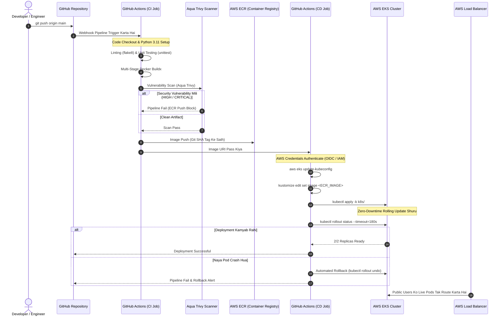

# 🎓 Enterprise EKS GitOps CI/CD Mastery Guide & Learning Path (Hinglish)

> 🌐 **Language Selector / مبدّل اللغات / भाषा चुनें**:  
> [🇬🇧 English](LEARNING_PATH.md) • **[🇮🇳 Hinglish (वर्तमान)]** • [🇸🇦 العربية](LEARNING_PATH.ar.md)

> **Author**: [Faisal Ansari](https://faisal.host) • [LinkedIn](https://www.linkedin.com/in/clumsyfaisal/)  
> **Target Cloud**: AWS (`ap-south-1` Mumbai)  
> **Orchestration**: Kubernetes on AWS EKS (`1.36+`)  
> **Pipeline Pattern**: Zero-Downtime GitOps with Aqua Trivy DevSecOps & Automated Rollback  
> **Public Endpoint**: [https://eks.faisal.host](https://eks.faisal.host) (AWS ELB + ACM SSL/TLS)

---

## 📑 Table of Contents
1. [DevOps & GitOps 101: Scratch Se Samajhte Hain (Beginners Foundation)](#1-devops--gitops-101-scratch-se-samajhte-hain-beginners-foundation)
2. [End-to-End Pipeline Ka Blueprint Aur Data Flow](#2-end-to-end-pipeline-ka-blueprint-aur-data-flow)
3. [Containerization & DevSecOps Deep Dive (Dockerfile & Trivy)](#3-containerization--devsecops-deep-dive-dockerfile--trivy)
4. [GitHub Actions Workflow Architecture (.github/workflows)](#4-github-actions-workflow-architecture-githubworkflows)
5. [Kubernetes Manifests & Production Workload Design](#5-kubernetes-manifests--production-workload-design)
6. [Metrics Server & Horizontal Pod Autoscaler (HPA) Deep Dive](#6-metrics-server--horizontal-pod-autoscaler-hpa-deep-dive)
7. [Kubernetes Networking & AWS Load Balancers Explained](#7-kubernetes-networking--aws-load-balancers-explained)
8. [Hands-On Operational Commands & Stress Testing Playbook](#8-hands-on-operational-commands--stress-testing-playbook)
9. [Top 15 DevSecOps & Kubernetes Interview Questions & Answers](#9-top-15-devsecops--kubernetes-interview-questions--answers)
10. [Real-World Production Troubleshooting & War Stories](#10-real-world-production-troubleshooting--war-stories)

---

## 1. DevOps & GitOps 101: Scratch Se Samajhte Hain (Beginners Foundation)

Agar aap ya koi learner cloud aur DevOps me bilkul naye hain, toh pehle basic concept samajhte hain:

### Purana Tareeka (ClickOps) Aur Uski Pareshaniyan
Pehle ke time par developers code likhte the, aur operations team ko email ya ticket bhejte the. Ops engineer AWS Console par login karta tha, manually buttons click karke EC2 instance banata tha, SSH karke code paste karta tha aur service restart karta tha.
- **Human Error**: Ek bhi galat port ya security group khula chhut gaya toh poora server hack ya down ho sakta hai.
- **No Audit Trail**: Pata hi nahi chalta kisne kab kaunsa button click kiya tha.
- **"It works on my machine" Problem**: Developer ke laptop par code chalta tha lekin production server par dependencies mismatch ki wajah se crash ho jata tha.

### Modern Solution: CI/CD & GitOps
1. **Continuous Integration (CI)**:
   Jaise hi developer apna code Git me `push` karta hai, ek automated worker (GitHub Actions) turant trigger ho jata hai. Woh code ka syntax check (linting) karta hai, unit tests run karta hai, Docker container banata hai aur security vulnerabilities (CVEs) scan karta hai. Agar ek bhi test fail hua, toh pipeline turant ruk jati hai (**Shift-Left Security**).
2. **Continuous Deployment (CD)**:
   Tests pass hote hi, image AWS ECR registry me push hoti hai aur bina kisi human intervention ke AWS EKS cluster me deploy ho jati hai.
3. **GitOps**:
   Git hamara **Single Source of Truth** hai. Har infrastructure change, container image version, aur scaling policy Git ke commit history me transparent hoti hai.

---

## 2. End-to-End Pipeline Ka Blueprint Aur Data Flow

Jab aap `git push origin main` run karte hain, toh background me step-by-step kya hota hai:



---

## 3. Containerization & DevSecOps Deep Dive (Dockerfile & Trivy)

### Multi-Stage Build Kyun Zaroori Hai?
Hamari [Dockerfile](file:///Users/deadpool/Documents/Project/cicd-eks-github-actions/Dockerfile) ko dekhte hain:
```dockerfile
# Stage 1: Build & Dependencies
FROM python:3.11-slim AS builder
WORKDIR /build
COPY app/requirements.txt .
RUN pip install --user --no-cache-dir -r requirements.txt

# Stage 2: Final Minimal Runtime
FROM python:3.11-slim
WORKDIR /app
COPY --from=builder /root/.local /home/appuser/.local
COPY app/ /app/
RUN groupadd -g 10001 appgroup && \
    useradd -u 10001 -g appgroup -s /bin/bash appuser && \
    chown -R appuser:appgroup /app
USER 10001:10001
```

#### Sabse Important Design Decisions:
1. **Lightweight Image**: Stage 1 me compile karne wale tools (pip cache, build compilers) rehte hain. Stage 2 me sirf zaroori files copy hoti hain, jisse image size 800MB se ghat kar ~150MB ho jata hai.
2. **Rootless Execution (`USER 10001:10001`)**: By default Docker containers `root` user (`UID 0`) ban kar chalte hain. Agar hamare application me koi security vulnerability nikli aur hacker ne container hack kar liya, toh root user hone ki wajah se woh poore AWS EC2 server par control kar sakta hai. Non-root user (`appuser`) hone se container breakout namumkin ho jata hai.
3. **Aqua Trivy Security Scan**: Image ko AWS ECR me upload karne se pehle Trivy scanner Debian OS packages aur Python libraries ko scan karta hai. Agar koi `HIGH` ya `CRITICAL` bug ya virus hua, toh pipeline turant band ho jayegi.

---

## 4. GitHub Actions Workflow Architecture (.github/workflows)

Hamara pipeline [.github/workflows/ci-cd-pipeline.yml](file:///Users/deadpool/Documents/Project/cicd-eks-github-actions/.github/workflows/ci-cd-pipeline.yml) do alag jobs me divided hai:

### Job 1: `build-and-test` (Continuous Integration)
- **Flake8**: Code formatting aur syntax errors verify karta hai.
- **Unittest**: Application routes (`/`, `/healthz`, `/readyz`) test karta hai.
- **Docker Buildx & Trivy**: Multi-stage image build karta hai aur vulnerability check karta hai.
- **ECR Push**: Git Commit SHA (e.g. `06767b1`) ka immutable tag laga kar push karta hai.

### Job 2: `deploy-to-eks` (Continuous Deployment)
- **Kustomize Image Injection**:
  ```bash
  cd k8s
  kustomize edit set image eks-demo-app=${{ needs.build-and-test.outputs.image }}
  kubectl apply -k .
  ```
  Isme kisi bhi YAML file ko manually edit nahi karna padta; Kustomize runtime me latest tag inject kar deta hai.
- **Automated Rollback Engine**:
  ```bash
  if ! kubectl rollout status deployment/eks-demo-app -n production --timeout=180s; then
    echo "Rollout fail ho gaya! Purane version par rollback kiya ja raha hai..."
    kubectl rollout undo deployment/eks-demo-app -n production
    exit 1
  fi
  ```
  Agar naye code me koi bug hua jiski wajah se pod 180 seconds ke andar healthy nahi hua, toh pipeline automatically purane chalte hue version par rollback kar deti hai!

---

## 5. Kubernetes Manifests & Production Workload Design

### A. Zero-Downtime Rolling Update Strategy ([k8s/deployment.yaml](file:///Users/deadpool/Documents/Project/cicd-eks-github-actions/k8s/deployment.yaml))
```yaml
strategy:
  type: RollingUpdate
  rollingUpdate:
    maxSurge: 25%        # Pehle naya pod banao, fir purana roko
    maxUnavailable: 0    # Kabhi bhi active capacity kam mat hone do
```
- Deployment ke dauraan Kubernetes pehle naya pod start karta hai.
- Jab naya pod `/readyz` probe pass kar leta hai, tabhi load balancer traffic nayi taraf bhejta hai aur purane pod ko band karta hai.
- Iska result: **0 seconds downtime aur users ko ek bhi error nahi dikhta**.

### B. High Availability with PodDisruptionBudget ([k8s/pdb.yaml](file:///Users/deadpool/Documents/Project/cicd-eks-github-actions/k8s/pdb.yaml))
```yaml
apiVersion: policy/v1
kind: PodDisruptionBudget
metadata:
  name: eks-demo-app-pdb
  namespace: production
spec:
  minAvailable: 1
  selector:
    matchLabels:
      app: eks-demo-app
```
**PDB Ka Kaam**: Jab AWS cluster maintenance ya EKS node upgrades hote hain, toh PDB ensure karta hai ki kam se kam 1 pod hamesha active rahe.

---

## 6. Metrics Server & Horizontal Pod Autoscaler (HPA) Deep Dive

### Metrics Server Kya Hai Aur Pehle `<unknown>` Kyun Tha?
Kubernetes default roop se pods ka CPU aur Memory track nahi karta. **Metrics Server** cluster ke andar ek background daemon hota hai jo har node ke kubelet se live CPU/RAM usage collect karke Kubernetes API ko deta hai.

Jab Metrics Server nahi hota, tab `kubectl get hpa` command me:
```text
TARGETS: cpu: <unknown>/70%, memory: <unknown>/80%
```
dikhata tha. Kyunki EKS ko CPU usage pata hi nahi tha, toh autoscaling so rahi thi. Humne Metrics Server install kiya aur yeh turant live percentages dikhane laga.

### HPA Scaling Ka Formula
[k8s/hpa.yaml](file:///Users/deadpool/Documents/Project/cicd-eks-github-actions/k8s/hpa.yaml) me:
- **Min Replicas**: 2
- **Max Replicas**: 10
- **CPU Target**: 70%

Jab traffic achanak badhta hai, toh HPA yeh formula use karta hai:
$$\text{Desired Replicas} = \left\lceil \text{Current Replicas} \times \left( \frac{\text{Current Metric Value}}{\text{Target Metric Value}} \right) \right\rceil$$

**Example**:
- Current Replicas = 2
- Current CPU = 140%
- Target CPU = 70%
- Calculation: $\lceil 2 \times (140 / 70) \rceil = \lceil 2 \times 2 \rceil = 4 \text{ Replicas}$.
Kubernetes turant 2 aur pods khade kar dega taaki load divide ho sake!

---

## 7. Kubernetes Networking & AWS Load Balancers Explained

| Service Type | Scope | Kaise Kaam Karta Hai? | Real-World Use Case |
| :--- | :--- | :--- | :--- |
| **`ClusterIP`** | Internal Only | Cluster ke andar ek private IP deta hai. Bahar se direct access nahi ho sakta. | Backend Databases, Redis cache, internal microservices. |
| **`NodePort`** | Node Level | Har EC2 node par ek high port (30000-32767) open karta hai. | Local development ya testing. |
| **`LoadBalancer`** | Public Internet | AWS cloud ko bolta hai ki ek Public Load Balancer (ELB/NLB) banao aur public traffic pods tak bhejo. | Web Applications jinko internet par directly chalana ho. |
| **`Ingress`** | L7 Routing | Ek single ALB ke peeche multiple domain names (`api.domain.com`, `app.domain.com`) aur SSL certificates manage karta hai. | Complex multi-service enterprise websites. |

Humne [k8s/service.yaml](file:///Users/deadpool/Documents/Project/cicd-eks-github-actions/k8s/service.yaml) me `type: LoadBalancer` set kiya. AWS ne automatically Mumbai region me ek public Elastic Load Balancer bana diya jisse ab koi bhi internet se bina `kubectl port-forward` ke direct website open kar sakta hai.

---

## 8. Hands-On Operational Commands & Stress Testing Playbook

Yeh commands har DevOps engineer ko zubaani yaad honi chahiye:

### 1. Live CPU aur Memory Check Karna
```bash
# Nodes ka resource consumption
kubectl top nodes

# Production pods ka consumption
kubectl top pods -n production

# HPA status dekhna
kubectl get hpa -n production
```

### 2. Load Balancer Ka Live Public URL Dekhna
```bash
kubectl get svc -n production -o wide
```
`EXTERNAL-IP` column me jo AWS DNS name hoga, wahi aapki website ka live public link hai.

### 3. Live Logs Stream Karna
```bash
kubectl logs -n production -l app=eks-demo-app -f --tail=50
```

### 4. Real Autoscaling Stress Test Chalana
Cluster ke andar artificial traffic generate karke dekhein ki kaise pods 2 se 10 scale hote hain:
```bash
# Terminal 1 me: HPA ko live watch karein
kubectl get hpa -n production -w

# Terminal 2 me: High traffic simulator shuru karein
kubectl run load-generator --rm -i --tty --image=busybox --restart=Never -- /bin/sh -c "while sleep 0.01; do wget -q -O- http://eks-demo-app-service.production.svc.cluster.local:80; done"
```
1-2 minute ke andar CPU 70% se upar jayega aur EKS automatically naye pods start kar dega. `Ctrl+C` dabate hi traffic band ho jayega aur cooldown period ke baad pods wapas 2 par aa jayenge.

---

## 9. Top 15 DevSecOps & Kubernetes Interview Questions & Answers

### Q1: Liveness, Readiness, aur Startup Probes me kya farak hai?
- **Liveness Probe**: Check karta hai ki container chal raha hai ya hang ho gaya. Agar fail hua, toh kubelet container ko **kill karke restart** kar deta hai.
- **Readiness Probe**: Check karta hai ki application user requests handle karne ke liye ready hai ya nahi. Agar fail hua, toh container restart nahi hota, balki load balancer se uska traffic hata diya jata hai.
- **Startup Probe**: Slow-booting applications (jaise legacy Java ya database sync) ke liye use hota hai taaki shuru hone se pehle liveness check container ko galti se kill na kar de.

### Q2: Kubernetes me Zero-Downtime deployments kaise hoti hain?
`strategy: RollingUpdate` aur `readinessProbe` ke combination se. Kubernetes pehle naya pod banata hai. Jab naya pod `/readyz` pass karta hai, tabhi load balancer naye pod par traffic bhejta hai aur fir purane pod ko band karta hai.

### Q3: Production manifests me `:latest` tag kyun nahi use karna chahiye?
1. `:latest` se pata nahi chalta ki kaunsa git commit chal raha hai.
2. Agar `imagePullPolicy: IfNotPresent` hai, toh node purani cached image chalata rahega aur naya code nahi uthayega.
3. Automated rollback fail ho jata hai kyunki tag name change nahi hota.
4. **Best Practice**: Hamesha immutable Git Commit SHA (`${{ github.sha }}`) use karein.

### Q4: Kustomize vs Helm me kya antar hai?
Helm me templates (`{{ .Values.image }}`) hote hain jo complex hote hain. Kustomize template-free hota hai aur standard YAML overlays use karta hai jo natively `kubectl apply -k` me supported hai.

### Q5: PodDisruptionBudget (PDB) kyun zaroori hai?
Jab AWS EKS cluster me node upgrade ya maintenance hoti hai, toh PDB enforce karta hai ki kam se kam `minAvailable: 1` pod hamesha zinda rahe taaki application down na ho.

### Q6: `CrashLoopBackOff` kya hota hai aur isko debug kaise karte hain?
Jab container start hota hai aur crash ho jata hai, aur Kubernetes bar-bar usko restart karne ki koshish karta hai.
**Debug karne ke commands**:
```bash
kubectl describe pod <pod-name> -n production   # Events section check karein
kubectl logs <pod-name> -n production --previous  # Crash hone se pehle ke logs dekhein
```

### Q7: `ImagePullBackOff` hone ke common reasons kya hain?
1. Image name ya tag me spelling mistake.
2. AWS ECR permissions missing (worker node IAM role par ECR policy nahi hai).
3. Private subnet me NAT Gateway ya VPC Endpoint na hona.

### Q8: `OOMKilled` (Exit Code 137) ka matlab kya hai?
Linux kernel Out-Of-Memory killer ne process ko terminate kar diya kyunki container ne apni `resources.limits.memory` limit cross kar di.

### Q9: Container ko root user (`UID 0`) par kyun nahi chalana chahiye?
Agar container root par chal raha ho aur application me RCE vulnerability ho, toh hacker container escape karke underlying AWS host machine ka poora root access le sakta hai.

### Q10: AWS ALB aur NLB me kya farak hai?
- **ALB (Layer 7)**: HTTP/HTTPS traffic, URL path-based routing (`/api`), SSL certificates, AWS WAF support. Ingress resource ke through banta hai.
- **NLB (Layer 4)**: TCP/UDP ultra-low latency traffic, millions of requests per second, source IP preserve karta hai. `Service` type `LoadBalancer` se banta hai.

### Q11: Aqua Trivy ka DevSecOps me kya role hai?
Trivy code aur container image ko build hote hi scan karta hai. Agar koi `CRITICAL` vulnerability mili, toh woh pipeline ko ECR push hone se pehle hi fail kar deta hai (Shift-Left).

### Q12: Database migrations automated CI/CD me kaise handle hoti hain?
Kubernetes `Job` ke through migration run ki jati hai. Jab Job successfully complete ho jati hai, tabhi deployment rolling update start karta hai. Agar migration fail ho, toh deployment ruk jati hai.

### Q13: Canary Deployment kya hota hai?
Naye version ko pehle sirf 5% real users ko bhejna, metrics monitor karna, aur sab theek rehne par baaki 95% users ko rollout karna.

### Q14: Blue/Green Deployment kya hota hai?
Do identical environments hote hain: Blue (live) aur Green (naya). Naye code ko Green me test karke Load Balancer ko 1 second me Blue se Green par switch kar diya jata hai.

### Q15: IAM Roles for Service Accounts (IRSA) kya hai?
Worker nodes ko broad AWS permissions dene ke bajaye, Kubernetes `ServiceAccount` ko AWS IAM role ke sath OIDC ke through bind kiya jata hai, jisse sirf specific pod ko least-privilege AWS access milta hai.

---

## 10. Real-World Production Troubleshooting & War Stories

### Case 1: Release ke dauraan 502 Bad Gateway Errors
- **Problem**: Release hote hi users ko 30 seconds ke liye errors dikhte the.
- **Wajah**: Application boot hone me 8 seconds leti thi, lekin `readinessProbe` missing tha. Kubernetes ne boot hone se pehle hi traffic naye pod par bhej diya.
- **Solution**: `readinessProbe` configure kiya aur rolling update me `maxUnavailable: 0` lagaya.

### Case 2: Autoscaling Ka Na Chalna (The Silent HPA Failure)
- **Problem**: Peak traffic par server crash ho gaya kyunki pods scale nahi hue.
- **Wajah**: EKS cluster me Metrics Server deploy nahi tha, aur HPA me `<unknown>` aa raha tha.
- **Solution**: Metrics Server install kiya jisse HPA ko live CPU percentages milne lage aur autoscaling seamlessly kaam karne lagi.

### Case 3: `:latest` Tag Se Rollback Ka Fail Hona
- **Problem**: Bug aane par engineer ne `kubectl rollout undo` kiya lekin code purana nahi hua.
- **Wajah**: Dono versions ka Docker tag `:latest` tha. Kubernetes ko pata hi nahi chala ki image change karni hai.
- **Solution**: Har build par unique Git Commit SHA tag lagaya jo Kustomize ke through dynamically manage hota hai.
