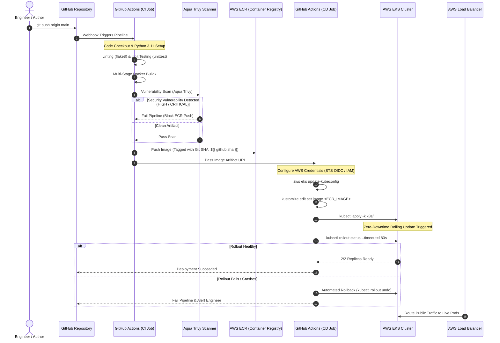

# 🎓 Enterprise EKS GitOps CI/CD Mastery Guide & Learning Path

> 🌐 **Language Selector / مبدّل اللغات / भाषा चुनें**:  
> **[🇬🇧 English (Current)]** • [🇮🇳 Hinglish](LEARNING_PATH.hi.md) • [🇸🇦 العربية](LEARNING_PATH.ar.md)

> **Author**: [Faisal Ansari](https://faisal.host) • [LinkedIn](https://www.linkedin.com/in/clumsyfaisal/)  
> **Target Cloud**: AWS (`ap-south-1` Mumbai)  
> **Orchestration**: Kubernetes on AWS EKS (`1.36+`)  
> **Pipeline Pattern**: Zero-Downtime GitOps with Aqua Trivy DevSecOps & Automated Rollback  
> **Public Endpoint**: [https://eks.faisal.host](https://eks.faisal.host) (AWS ELB + ACM SSL/TLS)

---

## 📑 Table of Contents
1. [DevOps & GitOps 101: Foundations from Scratch](#1-devops--gitops-101-foundations-from-scratch)
2. [High-Level Pipeline Blueprint & End-to-End Flow](#2-high-level-pipeline-blueprint--end-to-end-flow)
3. [Containerization & DevSecOps Deep Dive (Dockerfile & Trivy)](#3-containerization--devsecops-deep-dive-dockerfile--trivy)
4. [GitHub Actions Workflow Architecture (.github/workflows)](#4-github-actions-workflow-architecture-githubworkflows)
5. [Kubernetes Manifests & Production Workload Design](#5-kubernetes-manifests--production-workload-design)
6. [Metrics Server & Horizontal Pod Autoscaler (HPA) Deep Dive](#6-metrics-server--horizontal-pod-autoscaler-hpa-deep-dive)
7. [Kubernetes Networking & AWS Load Balancers Explained](#7-kubernetes-networking--aws-load-balancers-explained)
8. [Hands-On Operational Playbook & Stress Testing](#8-hands-on-operational-playbook--stress-testing)
9. [Top 15 DevSecOps & Kubernetes Interview Questions & Answers](#9-top-15-devsecops--kubernetes-interview-questions--answers)
10. [Production Troubleshooting & War Stories](#10-production-troubleshooting--war-stories)

---

## 1. DevOps & GitOps 101: Foundations from Scratch

If you are new to Cloud-Native engineering, this section establishes the fundamental core concepts before diving into the code.

### The Problem with "Manual" Deployments (ClickOps)
Traditionally, developers built code on their laptops, exported files via FTP/SSH, or logged into the AWS Web Console to manually click buttons, launch virtual machines, and restart web servers.
- **Human Error**: Misconfigured security groups, missed environment variables, or accidental deletions.
- **No Audit Trail**: Impossible to track who changed what setting or why an outage occurred.
- **Configuration Drift**: Staging and Production environments gradually diverged, leading to the infamous excuse: *"It works on my machine!"*

### The Modern Solution: CI/CD & GitOps
1. **Continuous Integration (CI)**:
   Every time code is pushed to Git, an automated robot (GitHub Actions Runner) tests the code, verifies linting style, builds an isolated container image, and scans it for security vulnerabilities. If any check fails, the build breaks immediately (**Shift-Left Security**).
2. **Continuous Deployment (CD)**:
   Once CI passes, the pipeline automatically packages the artifact, updates the deployment configuration, and pushes it to AWS EKS with zero human intervention.
3. **GitOps**:
   Git is the **Single Source of Truth** for the entire system. Infrastructure, container configurations, and Kubernetes states are stored as declarative code. If production drifts, Git reconciles it back.

---

## 2. High-Level Pipeline Blueprint & End-to-End Flow

Here is the exact sequence of events that occurs when a commit is pushed to the `main` branch:



---

## 3. Containerization & DevSecOps Deep Dive (Dockerfile & Trivy)

### Why Multi-Stage Builds?
In [Dockerfile](file:///Users/deadpool/Documents/Project/cicd-eks-github-actions/Dockerfile):
```dockerfile
# Stage 1: Build & Dependencies
FROM python:3.11-slim AS builder
WORKDIR /build
COPY app/requirements.txt .
RUN pip install --user --no-cache-dir -r requirements.txt

# Stage 2: Final Minimal Runtime
FROM python:3.11-slim
WORKDIR /app
COPY --from=builder /root/.local /home/appuser/.local
COPY app/ /app/
RUN groupadd -g 10001 appgroup && \
    useradd -u 10001 -g appgroup -s /bin/bash appuser && \
    chown -R appuser:appgroup /app
USER 10001:10001
```

#### Key Engineering Decisions:
1. **Attack Surface Reduction**: Build tools (gcc, git, pip cache) are discarded in Stage 1. Stage 2 only contains runtime binaries.
2. **Rootless Execution (`UID 10001`)**: By default, Docker containers run as `root` (`UID 0`). If an attacker exploits a remote code execution (RCE) vulnerability in Flask, running as root could grant them complete host-level compromise. Running as unprivileged `appuser` blocks container breakout attacks.
3. **Aqua Trivy Scanning**: Before pushing to AWS ECR, Trivy inspects OS packages (Debian) and Python wheels for known CVEs. Any `CRITICAL` vulnerability terminates the pipeline.

---

## 4. GitHub Actions Workflow Architecture (.github/workflows)

The pipeline in [.github/workflows/ci-cd-pipeline.yml](file:///Users/deadpool/Documents/Project/cicd-eks-github-actions/.github/workflows/ci-cd-pipeline.yml) is divided into two distinct decoupled jobs:

### Job 1: `build-and-test` (Continuous Integration)
- **Environment**: `ubuntu-latest`
- **Linting**: Runs `flake8` to enforce PEP8 standards and prevent syntax bugs.
- **Unit Tests**: Executes automated tests checking application routes (`/`, `/healthz`, `/readyz`).
- **ECR Push**: Tags the image with both `:latest` and the immutable Git Commit SHA (e.g. `06767b1`).

### Job 2: `deploy-to-eks` (Continuous Deployment)
- **Dependency**: `needs: build-and-test` (Ensures bad code never deploys).
- **Authentication**: Uses AWS credentials or OIDC to obtain short-lived STS tokens.
- **GitOps Kustomize**:
  ```bash
  cd k8s
  kustomize edit set image eks-demo-app=${{ needs.build-and-test.outputs.image }}
  kubectl apply -k .
  ```
- **Automated Rollback Engine**:
  ```bash
  if ! kubectl rollout status deployment/eks-demo-app -n production --timeout=180s; then
    echo "Rollout failed! Initiating automatic rollback..."
    kubectl rollout undo deployment/eks-demo-app -n production
    exit 1
  fi
  ```
  If new pods fail readiness checks within 180 seconds, Kubernetes automatically reverts to the previous revision.

---

## 5. Kubernetes Manifests & Production Workload Design

### A. Zero-Downtime Rolling Update Strategy ([k8s/deployment.yaml](file:///Users/deadpool/Documents/Project/cicd-eks-github-actions/k8s/deployment.yaml))
```yaml
strategy:
  type: RollingUpdate
  rollingUpdate:
    maxSurge: 25%        # Spin up new pods before killing old ones
    maxUnavailable: 0    # NEVER drop active capacity below desired count
```
- When deploying an update, Kubernetes starts new pods first.
- Only when new pods pass `/readyz` does Kubernetes remove traffic from old pods and shut them down gracefully.

### B. High Availability with PodDisruptionBudget ([k8s/pdb.yaml](file:///Users/deadpool/Documents/Project/cicd-eks-github-actions/k8s/pdb.yaml))
```yaml
apiVersion: policy/v1
kind: PodDisruptionBudget
metadata:
  name: eks-demo-app-pdb
  namespace: production
spec:
  minAvailable: 1
  selector:
    matchLabels:
      app: eks-demo-app
```
**Why PDB is critical**: During cluster node draining (e.g., EKS version upgrades or AWS spot instance terminations), Kubernetes guarantees that at least 1 pod remains running and serving traffic at all times.

---

## 6. Metrics Server & Horizontal Pod Autoscaler (HPA) Deep Dive

### What is Metrics Server and Why Was It Missing?
Kubernetes does not collect CPU/memory metrics by default. The **Metrics Server** is an in-cluster aggregator that scrapes resource metrics from each node's `kubelet` (via `cAdvisor`) and exposes them through the Metrics API (`metrics.k8s.io`).

Without Metrics Server, running `kubectl get hpa` shows:
```text
TARGETS: cpu: <unknown>/70%, memory: <unknown>/80%
```
Because the controller cannot read metrics, autoscaling is completely paralyzed.

### How HPA Calculates Desired Replicas
In [k8s/hpa.yaml](file:///Users/deadpool/Documents/Project/cicd-eks-github-actions/k8s/hpa.yaml):
- **Min Replicas**: 2
- **Max Replicas**: 10
- **CPU Target**: 70%
- **Memory Target**: 80%

When traffic surges, the HPA controller uses the mathematical formula:
$$\text{Desired Replicas} = \left\lceil \text{Current Replicas} \times \left( \frac{\text{Current Metric Value}}{\text{Target Metric Value}} \right) \right\rceil$$

**Real Example**:
- Currently running: 2 replicas.
- Incoming traffic causes CPU utilization to spike to 140%.
- Target CPU: 70%.
- Calculation: $\lceil 2 \times (140 / 70) \rceil = \lceil 2 \times 2 \rceil = 4 \text{ Replicas}$.
- Kubernetes immediately schedules 2 additional pods to distribute the load.

---

## 7. Kubernetes Networking & AWS Load Balancers Explained

| Service Type | Scope | How It Works | Use Case |
| :--- | :--- | :--- | :--- |
| **`ClusterIP`** | Internal Only | Allocates a virtual cluster-internal IP. Accessible only inside the Kubernetes cluster. | Backend databases, microservices communication. |
| **`NodePort`** | Node Level | Opens a dedicated port (30000-32767) on every node's external IP. | Debugging or basic setups without cloud load balancers. |
| **`LoadBalancer`** | Public Internet | Tells the cloud provider (AWS) to provision an Elastic Load Balancer (ELB/NLB) pointing to NodePorts. | Direct public web applications without ingress controllers. |
| **`Ingress`** | HTTP/HTTPS (L7) | Application-level routing (path-based `/api`, host-based `app.domain.com`) using ALB or NGINX. | Enterprise multi-service domain routing with SSL termination. |

In this project, [k8s/service.yaml](file:///Users/deadpool/Documents/Project/cicd-eks-github-actions/k8s/service.yaml) is configured as:
```yaml
spec:
  type: LoadBalancer
  ports:
    - name: http
      port: 80
      targetPort: 8080
      protocol: TCP
```
AWS automatically created a high-availability Classic/Network Load Balancer spanning multiple Availability Zones (`ap-south-1a`, `ap-south-1b`, `ap-south-1c`), forwarding public traffic directly to our application pods on port 8080.

---

## 8. Hands-On Operational Playbook & Stress Testing

Here are the essential commands for operating, testing, and debugging your EKS deployment:

### 1. View Cluster Resources & Live Metrics
```bash
# Check node resource consumption
kubectl top nodes

# Check pod resource consumption in production
kubectl top pods -n production

# Check Horizontal Pod Autoscaler status
kubectl get hpa -n production
```

### 2. Check Service & Load Balancer URL
```bash
kubectl get svc -n production -o wide
```
Look for `EXTERNAL-IP`. You can open this URL directly in your browser.

### 3. Stream Live Application Logs
```bash
kubectl logs -n production -l app=eks-demo-app -f --tail=50
```

### 4. Execute a Real Autoscaling Stress Test
Run an interactive traffic generator inside the cluster to watch HPA scale pods from 2 to 10 in real time:
```bash
# Terminal 1: Watch HPA in real-time
kubectl get hpa -n production -w

# Terminal 2: Run a continuous load generator pod
kubectl run load-generator --rm -i --tty --image=busybox --restart=Never -- /bin/sh -c "while sleep 0.01; do wget -q -O- http://eks-demo-app-service.production.svc.cluster.local:80; done"
```
Within 60-90 seconds, you will observe the CPU % spike above 70% and Kubernetes spin up new replicas. Once you press `Ctrl+C` in Terminal 2, Kubernetes will observe the cooldown period and safely scale back to 2 replicas.

---

## 9. Top 15 DevSecOps & Kubernetes Interview Questions & Answers

### Q1: What is the difference between Liveness, Readiness, and Startup probes?
- **Liveness Probe**: Determines if the container process is running. If it fails, kubelet **kills and restarts** the container.
- **Readiness Probe**: Determines if the application is ready to accept user requests. If it fails, Kubernetes stops sending traffic to the pod (removes it from endpoints), but does **not** restart it.
- **Startup Probe**: Pauses liveness and readiness checks during slow initialization (e.g. database migrations or cache warmup) to prevent premature container kills.

### Q2: How does Kubernetes achieve Zero-Downtime deployments?
By using `strategy: RollingUpdate` with `maxUnavailable: 0` and a reliable `readinessProbe`. Kubernetes boots new pods first, verifies they respond healthy to `/readyz`, adds them to the load balancer, and only then terminates older pods.

### Q3: Why should production manifests never use the `:latest` Docker tag?
1. `:latest` is mutable and non-deterministic—you cannot identify which commit is running.
2. If `imagePullPolicy: IfNotPresent` is set, nodes with cached `:latest` images will not pull code updates.
3. Automated rollback becomes impossible because image tags have not changed.
4. **Best Practice**: Tag images with the immutable Git commit SHA (`${{ github.sha }}`) or Semantic Versioning (`v1.2.3`).

### Q4: How does Kustomize simplify GitOps deployments compared to Helm?
Kustomize is template-free and built natively into `kubectl` (`kubectl apply -k`). Instead of string interpolations, Kustomize applies structured YAML overlays. In CI/CD pipelines, `kustomize edit set image` cleanly mutates container tags without modifying source files.

### Q5: What is a PodDisruptionBudget (PDB) and why is it essential for EKS?
A PDB limits the number of pods that can be simultaneously evicted during voluntary disruptions (e.g. EKS node OS patching, Karpenter node consolidation, cluster upgrades). `minAvailable: 1` prevents cluster maintenance operations from causing outages.

### Q6: What causes `CrashLoopBackOff` and how do you debug it?
Common causes:
1. Missing environment variables or database connection errors.
2. Port binding conflicts or running on privileged port (<1024) as non-root user.
3. Memory limit exceeded during startup or failed health check.
**Debugging commands**:
```bash
kubectl describe pod <pod-name> -n production  # Inspect Events section
kubectl logs <pod-name> -n production --previous # Inspect logs right before crash
```

### Q7: What causes `ImagePullBackOff` or `ErrImagePull`?
1. Typo in image repository URI or tag name.
2. Expired ECR credentials or missing IAM permissions on worker nodes (`AmazonEC2ContainerRegistryReadOnly`).
3. Private subnet worker nodes lacking a NAT Gateway or VPC Endpoint to reach AWS ECR.

### Q8: What is `OOMKilled` (Exit Code 137)?
The Linux kernel Out-Of-Memory killer terminated the container process because memory usage exceeded `resources.limits.memory`. Fix: Profile memory leaks or increase limits in `deployment.yaml`.

### Q9: Why run containers with non-root UID (`USER 10001:10001`)?
If an attacker achieves Remote Code Execution (RCE) inside a container running as root (`UID 0`), any kernel or container breakout exploit gives them root privileges over the underlying EC2 host node.

### Q10: What is the difference between AWS ALB and NLB on EKS?
- **ALB (Application Load Balancer)**: Layer 7 (HTTP/HTTPS). Supports host/path routing, SSL termination, and AWS WAF. Managed via AWS Load Balancer Controller and Kubernetes `Ingress`.
- **NLB (Network Load Balancer)**: Layer 4 (TCP/UDP). Ultra-low latency, handles millions of requests per second, preserves client source IP. Managed via Kubernetes `Service` of type `LoadBalancer`.

### Q11: How does Aqua Trivy integrate into a DevSecOps pipeline?
Trivy executes shift-left scans at the CI stage:
1. Scans application dependencies (`requirements.txt`).
2. Scans OS packages in container layers.
3. Automatically blocks the pipeline if CVE severity exceeds the allowed threshold (e.g. `CRITICAL`).

### Q12: How do you handle database migrations in automated EKS CI/CD?
Run migrations using a Kubernetes `Job` or Helm `pre-upgrade` hook before deploying new pods. If the migration job fails, the pipeline aborts immediately before changing deployment images.

### Q13: What is Canary Deployment?
A deployment pattern where new releases receive a small fraction of real production traffic (e.g., 5%) while 95% remains on the stable version. Errors and latency are monitored before rolling out to 100%.

### Q14: What is Blue/Green Deployment?
Two identical production environments exist: "Blue" (active) and "Green" (standby). The new version is deployed to Green, tested, and the load balancer switches 100% traffic from Blue to Green instantly.

### Q15: How does AWS IAM Roles for Service Accounts (IRSA) work?
Instead of attaching IAM permissions to worker EC2 nodes, IRSA uses OpenID Connect (OIDC) to bind an AWS IAM Role directly to a Kubernetes `ServiceAccount`. Pods receive temporary STS credentials with least privilege access.

---

## 10. Production Troubleshooting & War Stories

### War Story 1: The "Dying Pods During Deployment" Outage
- **Symptom**: During a production release, users experienced intermittent 502 Bad Gateway errors for ~30 seconds.
- **Root Cause**: The application took 8 seconds to boot, but had no `readinessProbe`. Kubernetes immediately routed traffic to the new pod before it finished initializing.
- **Resolution**: Added `readinessProbe` with `initialDelaySeconds: 5` and `periodSeconds: 5`. Configured `maxUnavailable: 0` in rolling update strategy.

### War Story 2: The Silent HPA Failure
- **Symptom**: Black Friday traffic surge crashed the application because pods refused to scale up, despite reaching 100% CPU.
- **Root Cause**: Metrics Server was never deployed to the cluster. `kubectl get hpa` showed `<unknown>` metrics.
- **Resolution**: Deployed Kubernetes Metrics Server and verified live CPU/Memory utilization reporting via `kubectl top pods`.

### War Story 3: The Broken `:latest` Rollback
- **Symptom**: A bug was introduced in production. The on-call engineer ran `kubectl rollout undo`, but nothing changed.
- **Root Cause**: Manifests used `image: my-app:latest`. Because the tag was identical for both revisions, Kubernetes saw no pod specification difference.
- **Resolution**: Switched to immutable Git SHA tags (`${{ github.sha }}`) managed dynamically via Kustomize in CI/CD.
