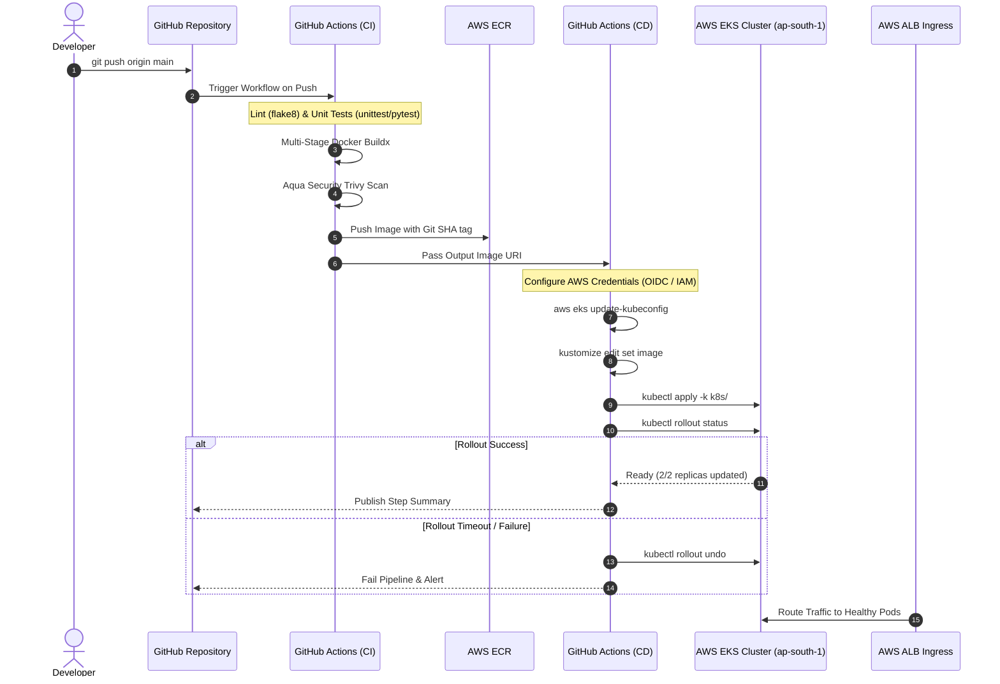

# 📖 Enterprise EKS GitOps CI/CD Architecture & Master Guide

This guide details the end-to-end engineering decisions, DevSecOps practices, and operational patterns implemented in `cicd-eks-github-actions` alongside `terraform-aws-eks-production`.

---

## 1. End-to-End Pipeline Architecture



---

## 2. Core DevSecOps & Cloud-Native Principles

### A. Rootless & Minimal Containerization
- **Multi-Stage Build**: Separates builder tools (compilers, build headers) from the final lightweight runtime image.
- **Non-Root Execution**: Runs as `appuser` (UID `10001`). Running containers as `root` (UID `0`) is a major security vulnerability that enables container escape exploits.
- **Container Hardening (`securityContext`)**:
  - `allowPrivilegeEscalation: false`: Prevents child processes from gaining elevated permissions (e.g. via `setuid` binaries).
  - `capabilities: drop: ["ALL"]`: Drops all Linux kernel capabilities (e.g. `CAP_SYS_ADMIN`, `CAP_NET_RAW`).

### B. DevSecOps Scanning with Aqua Trivy
Before any image is pushed to AWS ECR, Aqua Trivy scans both OS packages and application dependencies for **HIGH** and **CRITICAL** CVEs. This stops vulnerable artifacts from entering the registry or production cluster.

### C. Zero-Downtime Rolling Updates
In `k8s/deployment.yaml`:
```yaml
strategy:
  type: RollingUpdate
  rollingUpdate:
    maxSurge: 25%        # Spin up new pods before killing old ones
    maxUnavailable: 0    # Never reduce capacity below desired replicas
```
- When a new deployment occurs:
  1. Kubernetes schedules a new pod with the updated image.
  2. The pod passes the `readinessProbe` (`/readyz`).
  3. The pod is added to the Service endpoints / ALB target group.
  4. Only after the new pod is healthy does Kubernetes send `SIGTERM` to an old pod.
  5. The result: **Zero dropped requests and 100% availability**.

### D. Automated Rollback Safeguard
In `.github/workflows/ci-cd-pipeline.yml`:
```bash
if ! kubectl rollout status deployment/eks-demo-app -n production --timeout=180s; then
  echo "Rollout failed! Rolling back..."
  kubectl rollout undo deployment/eks-demo-app -n production
  exit 1
fi
```
If a faulty image or config causes pods to fail their readiness check, `kubectl rollout status` exits with an error and triggers an immediate automated rollback to the previous stable revision.

---

## 3. Authentication: OIDC vs Long-Lived Static Keys

In enterprise organizations, storing static `AWS_ACCESS_KEY_ID` and `AWS_SECRET_ACCESS_KEY` inside GitHub Secrets poses secret sprawl and rotation challenges.

### The Modern Standard: GitHub Actions OpenID Connect (OIDC)
GitHub Actions provides an OIDC token minted specifically for the workflow run. AWS STS validates this token and issues short-lived temporary security credentials:
1. **No static secrets stored anywhere**.
2. **Fine-grained IAM role scoping**: Restricted to only the `devopsfaisal/cicd-eks-github-actions` repository and the `main` branch.
3. **Automatic expiration**: Credentials expire within 1 hour.

---

## 4. Top 15 EKS CI/CD DevOps & SRE Interview Questions & Answers

### Q1: What is the difference between Liveness, Readiness, and Startup probes?
- **Liveness Probe**: Determines if the application is alive. If it fails, kubelet **restarts** the container.
- **Readiness Probe**: Determines if the application is ready to accept incoming traffic. If it fails, the pod is removed from Service endpoints / Load Balancer target groups, but is **not restarted**.
- **Startup Probe**: Disables liveness and readiness checks until the application has completed initial startup tasks (useful for slow-booting legacy apps).

### Q2: How does Kubernetes achieve Zero-Downtime deployments?
Through `RollingUpdate` with `maxUnavailable: 0` and properly configured `readinessProbe`. Kubernetes will not terminate older pods until newly created pods have successfully responded to readiness health checks and been registered in the endpoint list.

### Q3: Why should we avoid using the `:latest` tag in production Kubernetes manifests?
1. `:latest` is non-deterministic: you cannot tell which commit or artifact is running.
2. If `imagePullPolicy` is `IfNotPresent`, nodes will cache the old `:latest` image and not pull changes.
3. Rollbacks become impossible because the tag name hasn't changed.
4. **Best Practice**: Tag images with the immutable Git commit SHA (`${{ github.sha }}`) or Semantic Version (`v1.2.3`).

### Q4: How does Kustomize simplify GitOps deployments compared to Helm?
Kustomize is a template-free configuration management tool built natively into `kubectl`. Instead of string templating like Helm, Kustomize uses pure YAML overlays. In CI/CD, running `kustomize edit set image eks-demo-app=<ECR_URI>:<SHA>` allows dynamic image updates without touching raw application manifests.

### Q5: What is a PodDisruptionBudget (PDB) and why is it essential for EKS?
A PDB limits the number of pods of a replicated application that can be simultaneously down from voluntary disruptions (e.g. node drains during EKS version upgrades, Karpenter node consolidation, or cluster autoscaling). Setting `minAvailable: 1` guarantees that cluster maintenance will never take down your service.

### Q6: How does Horizontal Pod Autoscaler (HPA) make scaling decisions?
HPA queries the Kubernetes Metrics Server periodically (default 15s) for CPU and Memory consumption. If the target metric exceeds the defined threshold (e.g. 70% CPU), HPA calculates:
$$\text{Desired Replicas} = \lceil \text{Current Replicas} \times \left( \frac{\text{Current Metric Value}}{\text{Target Metric Value}} \right) \rceil$$

### Q7: What causes `CrashLoopBackOff` and how do you debug it?
Common causes:
1. Missing environment variables or configuration files.
2. Port binding conflicts or permission errors (e.g. unprivileged user trying to bind port 80).
3. Failing liveness probe.
**Debugging steps**:
- `kubectl describe pod <pod_name>` -> check Events at the bottom.
- `kubectl logs <pod_name> --previous` -> inspect the stdout/stderr before it crashed.

### Q8: What causes `ImagePullBackOff` or `ErrImagePull`?
1. Typo in image name or tag.
2. Missing or expired container registry credentials.
3. Node cannot reach AWS ECR due to missing NAT gateway or VPC Endpoints.
4. Worker Node IAM role missing `AmazonEC2ContainerRegistryReadOnly` policy.

### Q9: What is `OOMKilled` (Exit Code 137)?
The Linux kernel Out-Of-Memory killer terminated the process because the container exceeded its defined `resources.limits.memory`. Fix: Increase memory limit or profile the application for memory leaks.

### Q10: Why run containers as non-root (UID > 10000)?
If an attacker exploits a vulnerability in the application (like remote code execution) and the container is running as root (UID 0), any container breakout could grant them full root access over the host node. Non-root containers mitigate this attack surface.

### Q11: What is the role of AWS Load Balancer Controller in EKS?
Instead of creating classic Elastic Load Balancers, the AWS Load Balancer Controller manages:
- **ALB (Application Load Balancers)** when an `Ingress` resource is deployed.
- **NLB (Network Load Balancers)** when a `Service` of type `LoadBalancer` with AWS annotations is created.
It directly registers Pod IP addresses (Target Type `ip`) into AWS target groups, bypassing `kube-proxy` and NodePort latency.

### Q12: How do you handle database migrations in an EKS CI/CD pipeline?
Run database migrations using Kubernetes `Job` or `pre-install`/`pre-upgrade` Helm hooks before updating the Deployment. If the migration Job fails, the pipeline aborts before new pods roll out.

### Q13: What is Canary Deployment and how is it implemented on EKS?
A deployment pattern where a small percentage of production traffic (e.g., 5%) is routed to the new version before rolling it out to 100% of users. It can be implemented using:
- AWS App Mesh / Istio / Linkerd (Service Mesh).
- Argo Rollouts / Flagger.
- Ingress annotation weights (e.g. NGINX canary annotations).

### Q14: What is Blue/Green Deployment?
Two identical production environments exist: "Blue" (currently live) and "Green" (new version). Once Green passes smoke testing, the load balancer/route switch points all incoming traffic from Blue to Green instantly.

### Q15: How does Aqua Trivy integrate into DevSecOps?
Trivy operates at shift-left CI checkpoints:
1. **Filesystem Scan**: Scans source code and package lockfiles.
2. **Container Image Scan**: Scans OS packages and application dependencies inside container layers.
3. **IaC Scan**: Scans Terraform/Kubernetes manifests for misconfigurations before deployment.
